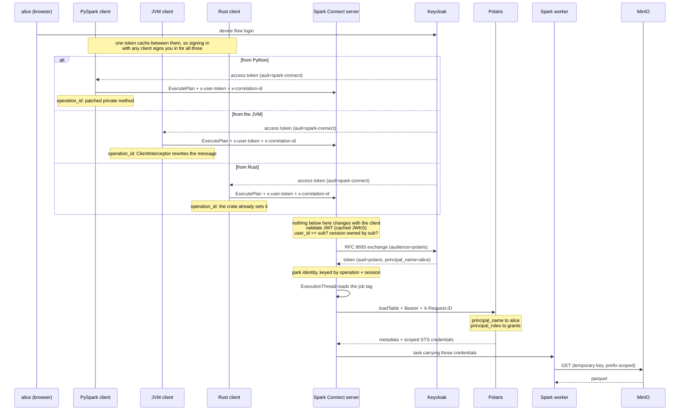

# Threading identity and correlation through Spark Connect

A working proof of concept: a PySpark client authenticates a real user, and that user's identity
travels through Apache Spark Connect into an Apache Polaris catalog and all the way down to
per-user credentials on object storage — with a correlation ID that can be grepped across every
service involved.

Spark holds **no object-storage credentials at all**. The only credentials on the data path are
the ones Polaris vends for whichever user made the request.

**Status:** complete and verified. 29 end-to-end checks against the live stack, plus 83 unit tests.
See [FINDINGS.md](FINDINGS.md) for what this exercise turned up about the upstream projects, and
[TODO.md](TODO.md) for the full decision record.

---

## What it demonstrates

| | |
|---|---|
| **Identity propagation** | A user's OIDC token reaches the Iceberg REST client, which runs on a different thread from the gRPC call that carried it |
| **Token exchange** | The server never forwards the user's token; it performs an RFC 8693 exchange for one addressed to Polaris |
| **Real authorisation** | alice reads a restricted table, bob is refused by Polaris — same server, same query, different token |
| **Identity-aware data plane** | alice and bob receive different temporary STS credentials, scoped by session policy to a single table prefix |
| **Correlation** | One UUID appears in the PySpark client, the Spark Connect server and Polaris, including on failures |
| **Session integrity** | A client claiming another user's `user_id`/`session_id` is refused — a gap Spark Connect leaves open by default |
| **The same identity in a UI** | The Apache Polaris console signs in as alice or bob through the same realm, and renders only what that user may see |
| **Three client languages** | The Python, JVM and Rust clients present the same headers and client-minted operation ids to one unchanged server |

## Quickstart

```bash
./install.sh     # checks the toolchain; asks before touching /etc/hosts
make build       # builds the Java plugin and the Spark image
make up          # starts the stack and waits for it
make demo        # interactive two-user walkthrough (device flow, opens a browser URL)
make demo-jvm    # the same walkthrough, driven by the JVM client
make demo-rust   # ... and by the Rust client
make test        # full suite on the host
```

`make test-unit` runs the client unit tests with no stack, no docker and no network.
`make test-container` runs the full suite inside the compose network, needing no host setup at
all. Between them: 26 Python unit tests, 19 end-to-end, 15 Java plugin tests via `make jar`, and
28 JVM client tests via `make test-jvm` and 14 Rust ones via `make test-rust` (each has five more
that run against the stack, with `make test-jvm-it` and `make test-rust-it`).

`install.sh` never runs a privileged command on its own. It prints exactly what it wants to do
and waits for a `y`. `--check` reports without changing anything, `--print-only` shows the
commands for you to run yourself.

Everything uses the compose service names as hostnames — the browser, the client and the
containers alike — because Keycloak stamps a single issuer into every token and OIDC validation
fails if they disagree. That is the only reason `/etc/hosts` is involved. The one exception is the
Polaris console, which you open at `http://localhost:3000`; see [below](#the-polaris-console).

Spark Connect also checks a channel-level pre-shared key of its own, which has nothing to do with
the user's token. The `Makefile` exports `CONNECT_SHARED_SECRET` (default `poc-shared-secret`) so
the host-run targets and the server agree on it; driving the client by hand needs the same value
in the environment, or Spark answers every RPC with `UNAUTHENTICATED: No authentication token
provided` before it ever looks at the user token.

## The path a query takes



The awkward step is the one in the middle. Spark Connect runs every operation on a fresh,
unpooled thread, so nothing the gRPC interceptor puts in a `ThreadLocal` survives to the code
that talks to Polaris. The bridge is the job tag Spark applies to that thread —
`SparkConnect_OperationTag_User_..._Session_..._Operation_...` — which the Iceberg `AuthManager`
parses to recover the Connect coordinates and look up the credential. The `Operation_` segment is
usable only because the client fills in `operation_id`, which Spark otherwise generates for itself
and never tells the client about.

Only the left-hand end of that picture changes between the three clients. The server is the same
binary, the same config and the same headers whichever one is talking to it:

| | Python | JVM | Rust |
|---|---|---|---|
| Headers on every RPC | gRPC interceptor | gRPC interceptor | fixed when the session opens |
| `user_id` = JWT `sub` | yes | yes | yes |
| `operation_id` | patched private method | interceptor rewrites the message | the crate already does it |
| Correlation scope | `with correlation_id()` | `CorrelationId.scope()` | one per session |
| Walkthrough | `make demo` | `make demo-jvm` | `make demo-rust` |

The last two rows are the same constraint seen twice: `spark-connect-rs` fixes a session's headers
when the session is built, so Rust scopes by session where the other two scope by block. Why each
column looks the way it does is in [FINDINGS.md](FINDINGS.md) §5, §12 and §13.

## Layout

```
install.sh              toolchain and /etc/hosts preflight; prompts before sudo
Makefile                install / build / up / demo{,-jvm,-rust} / test{,-jvm,-rust}{,-it} / cid / down
compose.yaml            keycloak, minio (+audit sink), polaris (+console), marquez, spark master/worker/connect
docker/keycloak/        realm: alice, bob, four clients, audience and claim mappers
docker/polaris/         idempotent bootstrap: catalog, namespaces, principals, grants
docker/polaris-console/ builds the Apache Polaris web console from pinned upstream source
docker/spark/           image, spark-defaults.conf, log4j2.properties, role entrypoint
server/                 the Java plugin (one Maven module, one jar)
client/                 the PySpark client package
client-jvm/             the same client for the JVM, in Java (Maven)
client-rust/            the same client in Rust, on the spark-connect-rs crate (Cargo)
demo/                   the walkthrough: demo.py, and java/ + rust/ for the same thing again
tests/                  the verification suite
```

### The Java plugin

| Class | What it does |
|---|---|
| `UserTokenServerInterceptor` | Validates the JWT, enforces subject-to-session binding, triggers the exchange, sets MDC |
| `TokenValidator` | nimbus with a cached JWKS, so steady-state validation touches no network |
| `TokenExchangeService` | RFC 8693 over the JDK HTTP client, cached by SHA-256 of the inbound token |
| `PropagatedIdentityHolder` | The thread bridge; parses the job tag off the ExecutionThread and resolves the identity by operation, then by session |
| `PropagatingRestAuthManager` | Stamps `Authorization` and `X-Request-ID` on every Polaris call |

The jar is baked into `$SPARK_HOME/jars` rather than passed with `--jars`. That is load-bearing:
`--jars` lands in a child classloader, which would give the interceptor and the auth manager two
different copies of the static holder, and the token would silently vanish.

### The Python client

```python
from spark_connect_propagation import DeviceCodeTokenProvider, Endpoints, connect, correlation_id

spark = connect(
    "sc://spark-connect:15002",
    DeviceCodeTokenProvider(Endpoints("http://keycloak:8080/realms/spark"), client_id="spark-cli"),
)

with correlation_id() as cid:
    spark.sql("SELECT * FROM polaris.shared.events").show()
    print("trace it:", cid)
```

The channel is built entirely on public PySpark API — `DefaultChannelBuilder`, `add_interceptor`
and `builder.channelBuilder` — so nothing here is a fork. Token acquisition is behind a
`TokenProvider` protocol: device flow for humans, password grant so the tests stay headless.

One private seam is used deliberately. PySpark never fills in
`ExecutePlanRequest.operation_id`, so the server generates an id the client never learns and the
interceptor can only file what it knows under the session. `connect()` patches
`_execute_plan_request_with_metadata` **on the client instance** to mint one per request, which
lets the server key per operation instead; pass `per_operation_ids=False` for a stock client. If a
future PySpark renames that method the patch is skipped, and the server falls back to keying by
session.

### The JVM client

`client-jvm/` is the same client for the JVM, in Java, published as
`io.sparkconnect:spark-connect-propagation-client:0.1.0` (`make client-jar` installs it locally).
It talks to the same server, presents the same headers and shares the device-flow token cache with
the Python one, so signing in with either signs you in for both.

```java
SparkSession spark = PropagatingSession.connect(
    "sc://spark-connect:15002",
    new DeviceCodeTokenProvider(new Endpoints("http://keycloak:8080/realms/spark"), "spark-cli"));

try (CorrelationId.Scope scope = CorrelationId.scope()) {
    spark.sql("SELECT * FROM polaris.shared.events").show();
    System.out.println("trace it: " + scope.id());
}
```

`PropagatingSession.builder(remote, provider)` takes the options: `sharedSecret` (defaults to
`CONNECT_SHARED_SECRET`), `sessionCorrelationId`, `perOperationIds`, and the two header names.

Three things differ from the Python client, none of them by choice:

* **Every seam is public.** `SparkConnectClient.builder().interceptor(...)` and
  `SparkSession.builder().client(...)` are public API, and rewriting an outgoing message is
  ordinary gRPC interceptor work — so `operation_id` is set without the private patch PySpark
  forces. One `ClientInterceptor` also covers every RPC shape, where PySpark needs one
  implementation per shape and silently leaves half the traffic unauthenticated if you forget one.
* **gRPC is relocated somewhere else.** The client jar puts it at `org.sparkproject.io.grpc.*`,
  which is *not* the server jar's `org.sparkproject.connect.grpc.*`. The two Spark artifacts shade
  the same library to two different packages, so a client and a server interceptor cannot share a
  superinterface.
* **It needs JVM flags.** Spark Connect returns Arrow batches, and Arrow reaches into `java.nio`
  reflectively, which Java 17+ encapsulates. Anything embedding this library needs

  ```
  --add-opens=java.base/java.nio=ALL-UNNAMED -Dio.netty.tryReflectionSetAccessible=true
  ```

  or the first `collect()` fails with `Could not initialize class ...arrow.memory.util.MemoryUtil`,
  which names neither the real problem nor the fix. The build sets them for its own tests.

`make test-jvm` runs its unit tests with no stack at all; `make test-jvm-it` runs it against the
live stack, asserting the same claims the Python suite does.

`make demo-jvm` is `make demo` driven by this client instead — `demo/java/` is a separate module
that depends on the published artifact, so running it also proves the library is consumable the
way anyone else would consume it. Both demos print the same walkthrough from the same unchanged
server, and because they share the token cache, whichever one you ran last leaves the other
already signed in.

### The Rust client

`client-rust/` is the third one, built on the [`spark-connect-rs`](https://crates.io/crates/spark-connect-rs)
crate. Same server, same headers, same `user_id` pinned to the JWT subject, and the same token
cache file as the other two.

```rust
let provider = PasswordGrantTokenProvider::new(
    Endpoints::new("http://keycloak:8080/realms/spark"), "spark-cli", "alice", "alice");

let spark = connect("sc://spark-connect:15002", &provider).await?;
spark.sql("SELECT * FROM polaris.shared.events").await?.show(Some(5), None, None).await?;
```

Two differences, and they run in opposite directions.

**It is the only one that needed nothing done about `operation_id`.** The crate already mints a
fresh UUID4 per ExecutePlan, which is exactly what the Python client needs a patched private
method for and the JVM client does with an interceptor. `make test-rust-it` asserts it, by
checking the server never logs `operation <server-generated>` for this client.

**It is the only one that cannot scope a correlation ID to a block.** The crate's session type is
fixed to one concrete middleware:

```rust
pub type SparkClient = SparkConnectClient<HeadersMiddleware<Channel>>;
```

and that middleware's headers are a `HashMap` captured when it is built, so a tonic interceptor or
a tower layer of our own would be a different type and would not fit a `SparkSession`. Headers are
therefore fixed for a session's life, which costs two things the others have: the token cannot be
re-read per RPC, so a session lasts as long as the token that opened it; and the correlation ID
cannot vary per call. The unit of scoping here is the session — `connect_with` takes the
correlation ID — and the crate exposes no `correlation_id()` block, rather than offering one that
silently does nothing.

`make test-rust` runs its unit tests with no stack at all; `make test-rust-it` runs it against the
live stack, and `make demo-rust` is the same walkthrough as `make demo`, driven by this client.
Like `demo/java/`, `demo/rust/` is a separate package that depends on the client rather than a
module inside it, so running it also proves the crate is consumable from outside.

The one visible difference between the three demos: this one mints its correlation ID *before*
signing anyone in, because the ID has to be in hand when the session is opened. The other two open
a scope around the queries instead.

## The Polaris console

The stack includes the Apache Polaris web console, which lives in
[apache/polaris-tools](https://github.com/apache/polaris-tools) under `console/` — not in
`apache/polaris`, which contains no UI at all. `docker/polaris-console/Dockerfile` builds it from
a pinned upstream commit rather than vendoring a copy, so there is nothing of theirs to keep in
sync here.

Open **[http://localhost:3000](http://localhost:3000)** and sign in as **alice** or **bob**. Note
the hostname: this is the one part of the stack you must *not* reach by its service name. The
console signs in with PKCE S256, which needs `crypto.subtle.digest`, and browsers expose
`window.crypto.subtle` only in a secure context — HTTPS, or plain HTTP on
`localhost`/`127.0.0.1`. That check looks at the literal hostname, so `http://polaris-console:3000`
does not qualify even though the alias points at loopback, and the sign-in button would fail with
`Cannot read properties of undefined (reading 'digest')` — a message that names neither the real
problem nor the fix. The console's own origin is not an issuer, so nothing else cares which one
you use.

Rather than leave that as a trap, `config.js` checks `isSecureContext` before the app loads and,
on a hostname that cannot work, replaces the page with an explanation and a link to the right one.
It is our file, generated at container start, and it is a classic script while the app bundle is a
deferred module — so it always runs first.

It uses authorization code
with PKCE against the same Keycloak realm Spark uses, so the token it receives carries the same
`principal_name` and `principal_roles` claims — which means the console is not an admin view. It
renders whichever catalog the logged-in user is actually entitled to:

| | `shared` | `restricted` |
|---|---|---|
| alice | visible | visible |
| bob | visible | **403** |

That is the same authorisation decision the Spark path hits, seen through a UI instead of a stack
trace. Two things make it work and are easy to miss: Polaris needs CORS opened for the console's
browser origin (Quarkus defaults it off), and the console's config is injected at container start
into `window.APP_CONFIG`, so one image can be pointed anywhere without a rebuild.

## Lineage, and where it collides with this design

The stack runs OpenLineage's Spark listener, reporting to [Marquez](https://marquezproject.ai) at
**http://localhost:3001**. It is a plain `SparkListener`, so Spark Connect changes nothing for it:
run `make test` or any demo and eight jobs show up —

```bash
curl -s localhost:5000/api/v1/namespaces/spark-connect-poc/jobs | jq '.jobs[].name'
```

```
spark_connect_server_propagation_po_c.create_table.restricted_salaries
spark_connect_server_propagation_po_c.append_data.polaris_restricted_salaries
spark_connect_server_propagation_po_c.drop_table
...
```

Each job-backed run carries **who asked and under which correlation ID**, in a facet of our own:

```json
"sparkConnectPropagation": {
  "correlationId": "22b19898-e641-4a08-8cb6-a8a9612e80c4",
  "principal": "alice",
  "subject": "9682af88-2cba-4543-9e4a-c2a37cbe78af",
  "sessionId": "56106cb6-a00e-4d11-9ef5-d38d81bd6468",
  "operationId": "aac54395-95f3-455d-845a-fa8d3c7ee36d"
}
```

So the same UUID that `make cid` greps out of Spark Connect and Polaris also identifies the run in
Marquez. `PropagationFacetFactory` registers through OpenLineage's ServiceLoader SPI, needing no
Spark configuration, and gets the identity from `SparkListenerJobStart`: Spark hands the
submitting thread's `spark.job.tags` over inside the event, so the tag that does not survive as a
ThreadLocal does survive here. Runs with no job start behind them — a DDL the catalog satisfies
without scheduling anything — get no facet. No token is ever put in an event.

**Every one of them still has empty `inputs` and `outputs`, and that is the interesting part.** To
name a dataset, OpenLineage loads the table from the catalog — on the listener bus thread. Carrying
the identity there was enough for a facet, because a name is just data; it is not enough for a
catalog call, which needs a live credential. So the AuthManager has nothing to present, sends the
call unauthenticated, Polaris answers 401, and the dataset goes unresolved:

```
WARN [,] PropagatingRestAuthManager: no propagated identity for this thread;
                                     sending an unauthenticated catalog request
```

Note the empty `[,]` where a correlation ID and principal would be. This is the same thread
boundary the whole PoC is about, met from the other side: a catalog that authorises per user can
only be read by something that *is* a user, and a collector running beside the query on its own
thread deliberately is not one. Giving the collector a service identity would fix it and would put
back the ambient credential this PoC exists to show you do not need. [FINDINGS.md](FINDINGS.md)
§14 lays out the three ways out and what each costs.

Each failed resolution is a 401, which Iceberg logs with a stack trace, so the Spark Connect log
carries roughly 76 of them per `make test`. That noise is left in deliberately: the only logger
that would silence it is the one that also reports genuine authorisation failures like bob's 403.
To run without it, blank `spark.extraListeners` in `docker/spark/spark-defaults.conf` and rebuild.

So take the lineage here as what it is: job-level lineage that works, and a worked example of two
reasonable designs that do not compose. Pin OpenLineage at 1.53.0 or newer, too — 1.34.0 does not
merely fail to collect on Spark 4.1.3, it throws from the listener and takes the SparkContext down
with it.

## Tracing a request

```bash
make cid CID=<uuid>
```

prints every line mentioning that correlation ID from both services:

```
26/09/18 21:35:59 DEBUG [5ca6e59a-...,alice] UserTokenServerInterceptor: ExecutePlan authenticated as alice
2026-09-18 21:36:04 INFO  [5ca6e59a-...,POLARIS] access-log: 172.22.0.6 - alice "GET /api/catalog/v1/..."
```

The Spark log pattern deliberately mirrors Polaris's own `[%X{requestId},%X{realmId}]` so the two
line up by eye.

## Sandbox credentials

`alice`/`alice` and `bob`/`bob` in the `spark` realm; Keycloak admin `admin`/`admin`; MinIO
`minio_root`/`m1n1opwd`; Polaris root `root`/`s3cr3t`. All of it is throwaway.

The quickest place to spend those two logins is the **[Polaris console](http://localhost:3000)** —
the same grants the Spark path enforces, seen through a UI instead of a stack trace. Open it on
`localhost`, not on `polaris-console`: see [The Polaris console](#the-polaris-console) for why, and
what the page tells you if you get it wrong.

| Service | URL |
|---|---|
| Keycloak | http://keycloak:8080 |
| Polaris | http://polaris:8181 |
| **Polaris console** | **[http://localhost:3000](http://localhost:3000)** — localhost, never the service name ([why](#the-polaris-console)) |
| MinIO console | http://minio:9001 |
| Marquez (lineage UI) | [http://localhost:3001](http://localhost:3001) |
| Marquez API | http://localhost:5000 |
| Spark master | http://spark-master:8082 |
| Spark driver UI | http://spark-connect:4040 |
| Spark Connect | sc://spark-connect:15002 |

## Not in scope

TLS between client and server; a token expiring *during* a single long-running query; Polaris
persistence (in-memory, re-bootstrapped on restart); secrets management. Known limitations,
including per-operation correlation within one session, are listed in [TODO.md](TODO.md).
