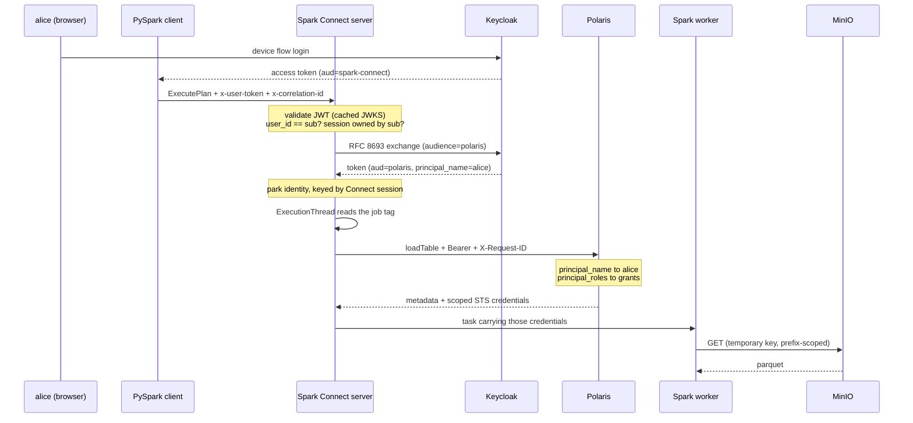

# Threading identity and correlation through Spark Connect

A working proof of concept: a PySpark client authenticates a real user, and that user's identity
travels through Apache Spark Connect into an Apache Polaris catalog and all the way down to
per-user credentials on object storage — with a correlation ID that can be grepped across every
service involved.

Spark holds **no object-storage credentials at all**. The only credentials on the data path are
the ones Polaris vends for whichever user made the request.

**Status:** complete and verified. `11 passed` end to end.
See [FINDINGS.md](FINDINGS.md) for what this exercise turned up about the upstream projects, and
[TODO.md](TODO.md) for the full decision record.

---

## What it demonstrates

| | |
|---|---|
| **Identity propagation** | A user's OIDC token reaches the Iceberg REST client, which runs on a different thread from the gRPC call that carried it |
| **Token exchange** | The server never forwards the user's token; it performs an RFC 8693 exchange for one addressed to Polaris |
| **Real authorisation** | alice reads a restricted table, bob is refused by Polaris — same server, same query, different token |
| **Identity-aware data plane** | alice and bob receive different temporary STS credentials, scoped by session policy to a single table prefix |
| **Correlation** | One UUID appears in the PySpark client, the Spark Connect server and Polaris, including on failures |
| **Session integrity** | A client claiming another user's `user_id`/`session_id` is refused — a gap Spark Connect leaves open by default |

## Quickstart

```bash
./install.sh     # checks the toolchain; asks before touching /etc/hosts
make build       # builds the Java plugin and the Spark image
make up          # starts the stack and waits for it
make demo        # interactive two-user walkthrough (device flow, opens a browser URL)
make test        # headless suite
```

`install.sh` never runs a privileged command on its own. It prints exactly what it wants to do
and waits for a `y`. `--check` reports without changing anything, `--print-only` shows the
commands for you to run yourself.

Everything uses the compose service names as hostnames — the browser, the client and the
containers alike — because Keycloak stamps a single issuer into every token and OIDC validation
fails if they disagree. That is the only reason `/etc/hosts` is involved.

## The path a query takes



The awkward step is the one in the middle. Spark Connect runs every operation on a fresh,
unpooled thread, so nothing the gRPC interceptor puts in a `ThreadLocal` survives to the code
that talks to Polaris. The bridge is the job tag Spark applies to that thread —
`SparkConnect_OperationTag_User_..._Session_..._Operation_...` — which the Iceberg `AuthManager`
parses to recover the session and look up the credential.

## Layout

```
install.sh              toolchain and /etc/hosts preflight; prompts before sudo
Makefile                install / build / up / bootstrap / demo / test / cid / down
compose.yaml            keycloak, minio (+audit sink), polaris, spark master/worker/connect
docker/keycloak/        realm: alice, bob, three clients, audience and claim mappers
docker/polaris/         idempotent bootstrap: catalog, namespaces, principals, grants
docker/spark/           image, spark-defaults.conf, log4j2.properties, role entrypoint
server/                 the Java plugin (one Maven module, one jar)
client/                 the PySpark client package
demo/  tests/           walkthrough and verification suite
```

### The Java plugin

| Class | What it does |
|---|---|
| `UserTokenServerInterceptor` | Validates the JWT, enforces subject-to-session binding, triggers the exchange, sets MDC |
| `TokenValidator` | nimbus with a cached JWKS, so steady-state validation touches no network |
| `TokenExchangeService` | RFC 8693 over the JDK HTTP client, cached by SHA-256 of the inbound token |
| `PropagatedIdentityHolder` | The thread bridge; parses the job tag off the ExecutionThread |
| `PropagatingRestAuthManager` | Stamps `Authorization` and `X-Request-ID` on every Polaris call |

The jar is baked into `$SPARK_HOME/jars` rather than passed with `--jars`. That is load-bearing:
`--jars` lands in a child classloader, which would give the interceptor and the auth manager two
different copies of the static holder, and the token would silently vanish.

### The Python client

```python
from spark_connect_propagation import DeviceCodeTokenProvider, Endpoints, connect, correlation_id

spark = connect(
    "sc://spark-connect:15002",
    DeviceCodeTokenProvider(Endpoints("http://keycloak:8080/realms/spark"), client_id="spark-cli"),
)

with correlation_id() as cid:
    spark.sql("SELECT * FROM polaris.shared.events").show()
    print("trace it:", cid)
```

Built entirely on public PySpark API — `DefaultChannelBuilder`, `add_interceptor` and
`builder.channelBuilder` — so there is no fork and no monkeypatching. Token acquisition is behind
a `TokenProvider` protocol: device flow for humans, password grant so the tests stay headless.

## Tracing a request

```bash
make cid CID=<uuid>
```

prints every line mentioning that correlation ID from both services:

```
26/09/18 21:35:59 DEBUG [5ca6e59a-...,alice] UserTokenServerInterceptor: ExecutePlan authenticated as alice
2026-09-18 21:36:04 INFO  [5ca6e59a-...,POLARIS] access-log: 172.22.0.6 - alice "GET /api/catalog/v1/..."
```

The Spark log pattern deliberately mirrors Polaris's own `[%X{requestId},%X{realmId}]` so the two
line up by eye.

## Sandbox credentials

`alice`/`alice` and `bob`/`bob` in the `spark` realm; Keycloak admin `admin`/`admin`; MinIO
`minio_root`/`m1n1opwd`; Polaris root `root`/`s3cr3t`. All of it is throwaway.

| Service | URL |
|---|---|
| Keycloak | http://keycloak:8080 |
| Polaris | http://polaris:8181 |
| MinIO console | http://minio:9001 |
| Spark master | http://spark-master:8082 |
| Spark driver UI | http://spark-connect:4040 |
| Spark Connect | sc://spark-connect:15002 |

## Not in scope

TLS between client and server; a token expiring *during* a single long-running query; Polaris
persistence (in-memory, re-bootstrapped on restart); secrets management. Known limitations,
including per-operation correlation within one session, are listed in [TODO.md](TODO.md).
